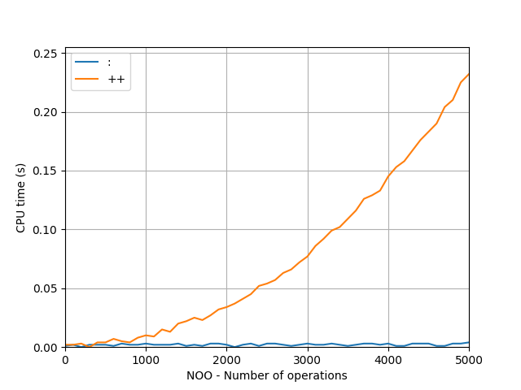

# Performance Visualisierung
Code um den Performance Unterschied zwischen Prependen und Appenden (Cons Operator vs ++) zu visualisieren. Wer einen eleganteren Weg kennt, um Haskell Funktionen zu timen, darf sich gerne bei mir melden.

## Dependencies
_python_  
- matplotlib

## Usage
Im Ordner `timeit` das Shell-Script `run.sh` via `./run.sh` ausführen.
Anschließend den gewünschten Namen des plots angeben.  

Der entstandene Plot wird unter `timeit/plots` gespeichert. (als svg, png, pdf)

Die gewünschte Anzahl der durchzuführenden Operationen und die Größe der Schritte zwischen Messwerten, lässt sich im Script `run.sh` verändern. Dazu die Variablen `MAXOPS` und `STEPSIZE` verwenden.

## Beispiel
Plot für 0 bis 5000 Operationen, Schrittgröße 100. (50 Messwerte)  

